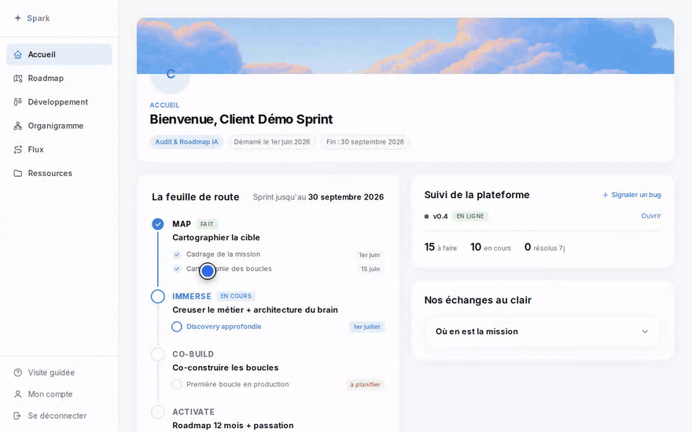

# silex-spark

Plugin Claude / Codex / OMP pour l’**API Spark** : tickets Pilotage, board Tâches, ressources, journeys, organigramme, accueil, projets et relations. Authentification par PAT personnelle `spu_…` (droits du compte).

Produit : [https://spark.gosilex.com](https://spark.gosilex.com)

| Skill | Rôle |
| --- | --- |
| `spark-setup` | Écrire `~/.config/silex/spark.env` (URL + PAT) |
| `spark-tickets` | Tickets, comments, tasks board, resources/journeys/org/accueil, projets, liens, GitHub |

## Miroir public

**SoT = dépôt privé `go-silex/spark`, dossier `plugins/silex-spark/`.**  
Ce dépôt GitHub (`go-silex/silex-spark`) est un **miroir en lecture seule**, synchronisé depuis `main` (prod). Issues et PRs ne sont pas le canal de contribution — voir `CONTRIBUTING.md`.

## Install (Claude Code)

```bash
claude plugin marketplace add go-silex/silex-spark
claude plugin install silex-spark@silex-spark --scope user
claude plugin marketplace update silex-spark
claude plugin update silex-spark@silex-spark
```

L’id d’install client est **`silex-spark@silex-spark`**. `update silex-spark` seul échoue (« Plugin not found ») — toujours l’id complet.

### extraKnownMarketplaces (optionnel)

Dans `.claude/settings.json` :

```json
{
  "extraKnownMarketplaces": {
    "silex-spark": {
      "source": {
        "source": "github",
        "repo": "go-silex/silex-spark"
      },
      "autoUpdate": true
    }
  },
  "enabledPlugins": {
    "silex-spark@silex-spark": true
  }
}
```

## Install (OMP)

```bash
omp plugin install 'github:go-silex/silex-spark#main'
```

## Config machine

### Secrets (PAT)

**Pourquoi.** Les agents parlent à Spark avec **tes** droits (pas une clé d’app M2M `spk_`). Une PAT `spu_…` se génère dans l’UI, s’affiche **une seule fois**, et vit hors git.

**Comment.** Spark → **Mon compte** (menu gauche) → **Clés API** → libellé → **Générer une clé** → **Copier**.



Puis :

```bash
mkdir -p ~/.config/silex && chmod 700 ~/.config/silex
cat > ~/.config/silex/spark.env <<'EOF'
SPARK_URL=https://spark.gosilex.com
SPARK_USER_API_KEY=spu_…
EOF
chmod 600 ~/.config/silex/spark.env
```

Ordre PAT : env `SPARK_USER_API_KEY` → `spark.env` → `spark-user-api-key` → BW `gosilex/spark-user-api-key`.

### Client / projet (non secret)

| Fichier | Rôle |
|---------|------|
| `./config/spark.yml` | Défaut workspace (équipe, commitable) |
| `~/.config/silex/spark.yml` | Défaut machine |
| `config/spark.example.yml` | Template |

```bash
bash "$SCRIPT" config init --client acme [--project App]   # projet
bash "$SCRIPT" config init --client acme --global            # machine
bash "$SCRIPT" config show
bash "$SCRIPT" tickets list   # client implicite
bash "$SCRIPT" tickets get 42
```

Priorité : CLI / `--client` → `SPARK_CLIENT` → config projet → spark.yml global.

## CLI (agents)

Les skills résolvent `spark.sh` **uniquement** via `CLAUDE_PLUGIN_ROOT` (plugin marketplace installé). Pas de fallback vers un clone git local.

```bash
: "${CLAUDE_PLUGIN_ROOT:?installer silex-spark@silex-spark}"
SCRIPT="${CLAUDE_PLUGIN_ROOT}/skills/spark-tickets/scripts/spark.sh"

bash "$SCRIPT" meta
bash "$SCRIPT" meta-links
bash "$SCRIPT" meta-projects
bash "$SCRIPT" tickets list acme          # chaque ticket.links inclus
# Create : défaut staff/agent = **interne** (pas de notif client).
# Ticket visible client / notif client → **--public** obligatoire.
# Priorité dès le create → --priority p0|p1|p2|p3 (sinon p2).
bash "$SCRIPT" tickets create acme "Tech debt …" "…"           # interne (défaut)
bash "$SCRIPT" tickets create acme "Bug UI budget" "…" --public # visible client
bash "$SCRIPT" tickets create acme "Hotfix images" "…" --public --priority p0
bash "$SCRIPT" tickets patch <id> '{"priority":"p1"}'
# Discussion (comments = fil ticket Pilotage)
bash "$SCRIPT" tickets get <id|ref> [--client slug]
bash "$SCRIPT" tickets comments list <id>
bash "$SCRIPT" tickets comments add <id> "Message" [--parent N] [--internal]
bash "$SCRIPT" resources list acme
bash "$SCRIPT" resources create acme "Lecture" "https://…" --category Lectures
bash "$SCRIPT" journeys list acme
bash "$SCRIPT" journeys create acme "Onboarding"
bash "$SCRIPT" orgchart get acme
bash "$SCRIPT" orgchart put acme '{"nodes":[],"edges":[]}'
bash "$SCRIPT" accueil get acme
bash "$SCRIPT" accueil patch acme '{"recap":"## MAJ\n"}'
bash "$SCRIPT" tasks list acme
bash "$SCRIPT" tasks create acme "Nouvelle tâche" "détail"
bash "$SCRIPT" ideas create acme "Une idée"            # visible (défaut)
bash "$SCRIPT" ideas create acme "Note staff" --internal
bash "$SCRIPT" tasks patch <id> '{"priority":"p1"}' --client acme
bash "$SCRIPT" tasks comments add <id> "note" --client acme
bash "$SCRIPT" projects list acme --kind development
bash "$SCRIPT" projects create acme "App mobile" development coral
bash "$SCRIPT" projects patch <id> '{"name":"Nouveau nom"}'
bash "$SCRIPT" links list acme
bash "$SCRIPT" links add acme 18 parent 12
bash "$SCRIPT" links add acme 18 blocked_by 12
bash "$SCRIPT" links delete acme <linkId>
```

Alias shell (hors agent) — cache marketplace, **pas** un clone git :

```bash
# dernière version installée du plugin
ROOT=$(ls -d "$HOME/.claude/plugins/cache/silex-spark/silex-spark"/*/ 2>/dev/null | sort | tail -1)
alias spark-api="bash ${ROOT}skills/spark-tickets/scripts/spark.sh"
```

Développeurs Silex : dans un clone de `go-silex/spark`, la marketplace colocated reste **`silex-spark@spark`** (directory `.`) ; pas besoin d’installer le miroir public pour travailler dans ce repo.

## License

[MIT](LICENSE)
